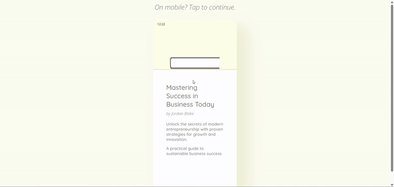
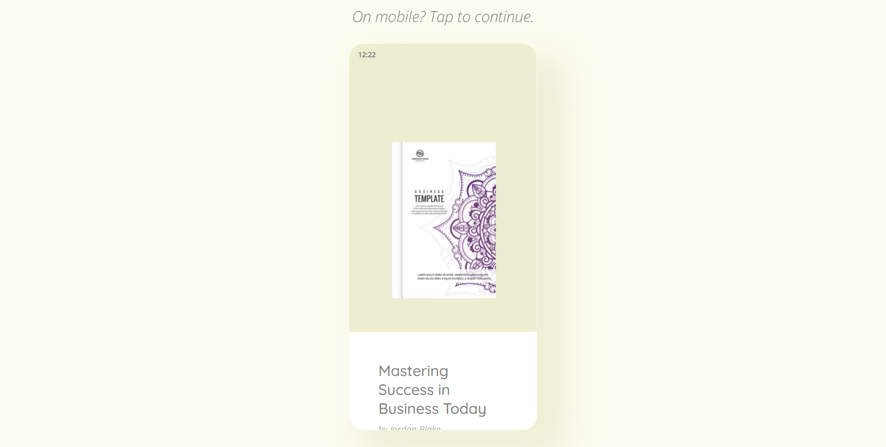
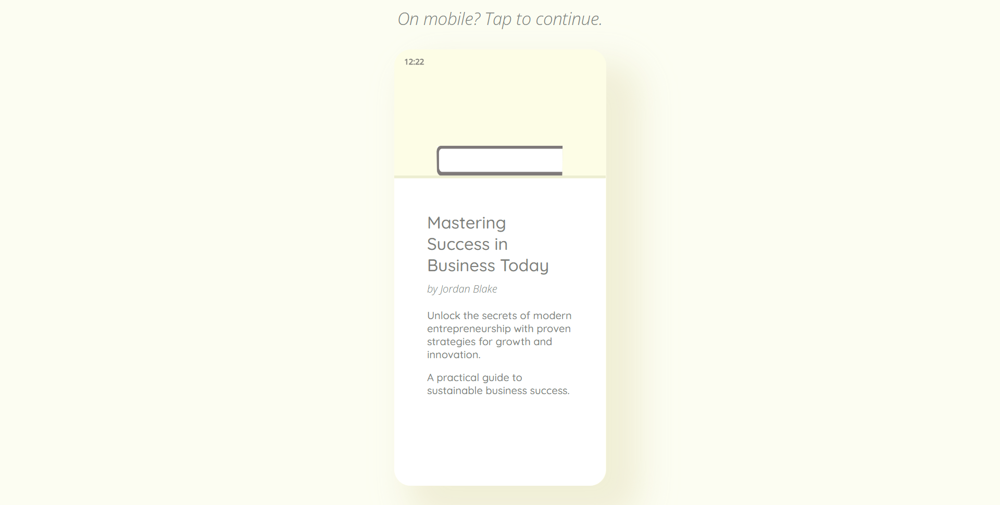
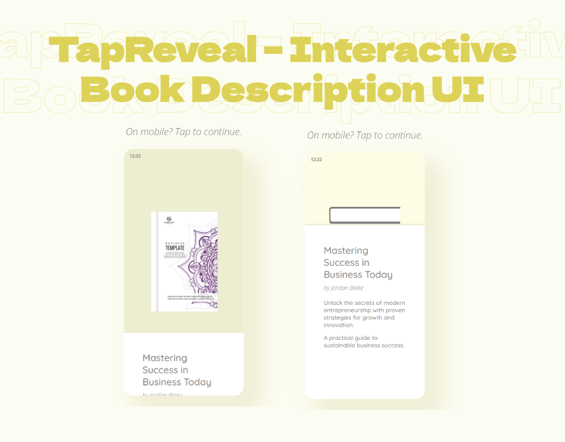

# TapReveal – Interactive Book Description UI 📚✨

**TapReveal** is a sleek, interactive UI component designed for mobile and web platforms. It allows users to tap on a book card to reveal or hide the description with a smooth sliding animation. On desktop, it includes a subtle hover effect for enhanced engagement.

---

## ✨ Features

- 📱 Mobile-friendly tap interaction
- 🖱️ Desktop hover effects
- 🎬 Smooth slide-up/down animation for book descriptions
- 🔄 Toggle behavior on repeated taps
- 💡 Lightweight and easy to integrate into any project

---

## 🛠️ Tech Stack

- HTML5
- CSS3 (with transitions)
- Vanilla JavaScript

---

 
Desktop Design 

 
Design UI UX Layout 

  
Desktop Design UI UX Layout 

  
Desktop Design 

 
Cover 
